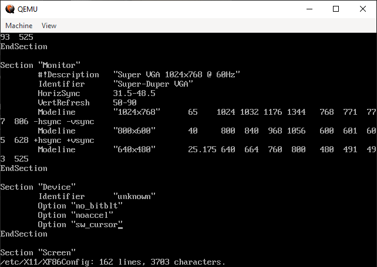

# freeasinweekend.org
Free. As in weekend.

Corel Linux on Windows using qemu

```
qemu-img create corel_linux_hd.img 2G


qemu-system-i386 -hda corel_linux_hd.img -cdrom corel_linux_1.2.iso -m 256 -vga cirrus -net nic,model=pcnet

Does it work without the net?

qemu-system-i386 -hda corel_linux_hd.img -cdrom corel_linux_1.2.iso -m 256 -vga cirrus


```

THEN

````
qemu-system-i386 -hda corel-linux-hd.img -m 256 -vga cirrus -net nic,model=pcnet

or even:

qemu-system-i386 -hda corel-linux-hd.img -m 256 -vga cirrus
````

OK, start again from the beginning:

```
qemu-img create corel_linux_hd.img 2G
qemu-system-i386 -hda corel_linux_hd.img -cdrom corel_linux_1.2.iso -m 256 -vga cirrus
```

That brings up a usable installer with garbled text. 

Let it complete, let it reboot: when you get the loading screen, load text mode.

Edit /etc/X11/XF86config, find the section called "Device", add three lines:

```
Option "no_bitblt"
Option "noaccel"
Option "sw_cursor"
```





Run it with

```
qemu-system-i386 -hda corel_linux_hd.img -m 256 -vga cirrus -net nic,model=pcnet
```

NETWORKING

Install tapwindows: from an elevated terminal prompt:

```
choco install tapwindows
```

find the "TAP-Windows Adapter V9" in Windows Network Connections, rename it to "TapWindows"


and enable internet connection sharing on the **main connection you actually use to connect to the network**, specifying that users connected to TapWindows can use Ethernet to talk to the internet:


```
qemu-system-i386 -hda corel_linux_hd.img -m 256 -vga cirrus `
	-netdev tap,id=mynet0,ifname=TapWindows,script=no,downscript=no `
	-device rtl8139,netdev=mynet0,mac=de:ad:be:ef:12:34
```

didn't work.

https://superuser.com/questions/1541158/windows-qemu-how-to-create-multiple-tap-windows-adapter-v9


Try this:

```
qemu-system-i386 -hda corel_linux_hd.img -m 256 -vga cirrus `
-net tap,ifname=TapWindows,script=no,downscript=no -net nic,model=rtl8139
```

