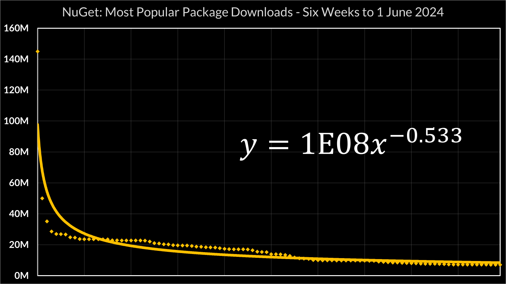

---

layout: article
typora-root-url: ./
---

## Calculations and Statistics

In the talk that accompanies this website, I come up with some hypothetical numbers for how much open source project maintainers might get paid if there was a package repository which used a similar revenue model to streaming services like Spotify.

Here's how I got the numbers, so you can check the arithmetic, and play around with your own inputs.

### Total Download Figures

I based all this figures available at [https://www.nuget.org/stats](https://www.nuget.org/stats).

NuGet doesn't publish total download figures, but at they do publish the [top 100 community packages over the last 6 weeks](https://www.nuget.org/stats/packages).

I copied this data into [this Excel spreadsheet](nuget-top-100-package-downloads-20240530.xlsx), plotted it as a scatter graph, and added a power trend line:




Integrating that curve should give a reasonable estimate for the total number of downloads in that period. At the time of writing, nuget.org's homepage claims 7,397,236 versions of 404,574 unique packages. The download charts are per package, not per version, so to estimate the total number of downloads, we need to integrate y = 1E8x^-0.533 between 1 and 404,574.

[Plugging that into Wolfram Alpha](https://www.wolframalpha.com/input?i=integrate+%28%5B%2F%2Fmath%3A1E%2B08x%5E-0.533%2F%2F%5D%29+from+%5B%2F%2Fmath%3A1%2F%2F%5D+to+%5B%2F%2Fmath%3A404574%2F%2F%5D) gives us 88,736,900,000. Just under 89 billion.

> As a sanity check: integrating that curve between 1 and 100 gives us 1,625,300,000, and the sum of the figures in the top 100 data set is 1,671,910,909, which gives us an error margin of ±3%, which is close enough for what I'm trying to do here.

### Unique NuGet Users

This one's the fudgiest step of the whole process. I added up the [total number of downloads](https://www.nuget.org/stats/packages/Newtonsoft.Json?groupby=Version) of Newtonsoft.Json, the most popular package on NuGet, in the last six weeks.

That's 145,018,735 downloads in six weeks, or 145,018,735/6 = 24,169,789 downloads per week. Then, in the absence of any better data, I estimated the average NuGet user downloads Newtonsoft.Json ten times a week, giving 2.4 million active users.

### Finding the Active Packages

I wanted to find out how many of the 404,574+ packages on NuGet are actually actively maintained. This one was a little trickier: NuGet doesn't publish that data on the web, but it *is* available via the NuGet API... only problem is, that's a *huge* dataset. The NuGet API exposes a resource called the **catalog**, an [append-only data set that shows the full history](https://learn.microsoft.com/en-us/nuget/guides/api/query-for-all-published-packages#overview) of packages added to, modified and deleted from nuget.org.

I wrote a  .NET console app that retrieves entries from the NuGet catalog and loads them into a local SQL database - you can find the whole thing on GitHub, or in [NugetCat.zip](NugetCat.zip)

Data table definition:

```sql
-- SQL schema definition for Packages database

```

The actual program uses SQL Bulk Copy and Marc Gravell's excellent [FastMember](https://github.com/mgravell/fast-member) package to "throw data into a database as fast as humanly possible"; on my PC it took 739681ms - about 12 minutes - to import all 13,140,797 events currently in the catalog.

```csharp
// NugetCat/Program.cs

```

With the data imported, I could query the catalog for packages which had at least one release in the last 12 months, and which had never been deleted:

```sql
SELECT
	PackageId,
	MAX(CommitTimestamp) as MostRecentEntry,
	COUNT(*) as Releases
FROM Packages
WHERE CommitTimestamp > '2023-06-01'
and Type = 'nuget:PackageDetails'
and PackageId NOT IN (
	SELECT PackageId
	FROM Packages
	WHERE Type = 'nuget:PackageDelete'
)
GROUP BY PackageId
```

That gave me 138,843 unique packages which have had a release/update since 1st June 2023.

In case you're curious: the most active packages on NuGet are four packages which are part of Octopus Server  ([1](https://www.nuget.org/packages/Octopus.Server.MessageContracts.Base), [2](https://www.nuget.org/packages/Octopus.Server.MessageContracts.Base.HttpRoutes), [3](https://www.nuget.org/packages/Octopus.Server.MessageContracts), [4](https://www.nuget.org/packages/Octopus.Server.MessageContracts.HttpRoutes)), all of which had 5,916 releases when I wrote this - an average of 16 releases per day. At the other extreme, there's over 34,000 packages which have only had a single release in the last twelve months.

Anyway. That's where I got the numbers that I used in the revenue model I go through in the talk: 138,843 active packages, and 2.4 million active users.

Plugging that 138,843 into [the Wolfram Alpha integral](https://www.wolframalpha.com/input?i2d=true&i=Integrate%5B1E8Power%5Bx%2C-0.533%5D%2C%7Bx%2C1%2C138843%7D%5D) gives an estimate of 53,767,000,000 total downloads in the last six weeks.

