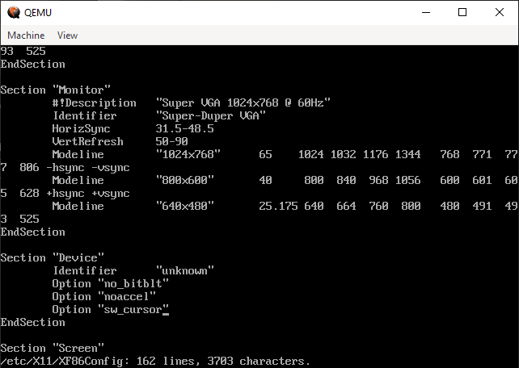

# freeasinweekend.org
Free. As in weekend.

OK, how to install Windows 2000 on QEMU

```
qemu-img create windows_2000_hd.img 4G

qemu-system-i386 -hda windows_2000_hd.img -cdrom windows_2000_professional.iso `
-m 256 -vga cirrus -audiodev driver=dsound,id=pa1 -device ac97,audiodev=pa1 `
-netdev tap,id=mynet0,ifname=TapWindows,script=no,downscript=no `
-device rtl8139,netdev=mynet0,mac=52:55:00:d1:55:01
```

The network:

Shared the main network connection (`Ethernet`), and select the `TapWindows` connection as the "Home networking connection"


and to run it:

```
qemu-img create windows_2000_hd.img 4G
qemu-system-i386 -hda windows_2000_hd.img `
-m 256 -vga cirrus -audiodev driver=dsound,id=pa1 -device ac97,audiodev=pa1 `
-netdev tap,id=mynet0,ifname=TapWindows,script=no,downscript=no `
-device rtl8139,netdev=mynet0,mac=52:55:00:d1:55:01
```


### Corel Linux on Windows using qemu

```
qemu-img create corel_linux_hd.img 2G


qemu-system-i386 -hda corel_linux_hd.img -cdrom corel_linux_1.2.iso -m 256 -vga cirrus -net nic,model=pcnet

Does it work without the net?

qemu-system-i386 -hda corel_linux_hd.img -cdrom corel_linux_1.2.iso -m 256 -vga cirrus


```

THEN

````
qemu-system-i386 -hda corel-linux-hd.img -m 256 -vga cirrus -net nic,model=pcnet

or even:

qemu-system-i386 -hda corel-linux-hd.img -m 256 -vga cirrus
````

OK, start again from the beginning:

```
qemu-img create corel_linux_hd.img 2G
qemu-system-i386 -hda corel_linux_hd.img -cdrom corel_linux_1.2.iso -m 256 -vga cirrus
```

That brings up a usable installer with garbled text. 

Let it complete, let it reboot: when you get the loading screen, load text mode.

Edit /etc/X11/XF86config, find the section called "Device", add three lines:

```
Option "no_bitblt"
Option "noaccel"
Option "sw_cursor"
```





Run it with

```
qemu-system-i386 -hda corel_linux_hd.img -m 256 -vga cirrus -net nic,model=pcnet
```

NETWORKING

Install tapwindows: from an elevated terminal prompt:

```
choco install tapwindows
```

find the "TAP-Windows Adapter V9" in Windows Network Connections, rename it to "TapWindows"


and enable internet connection sharing on the **main connection you actually use to connect to the network**, specifying that users connected to TapWindows can use Ethernet to talk to the internet:


```
qemu-system-i386 -hda corel_linux_hd.img -m 256 -vga cirrus `
	-netdev tap,id=mynet0,ifname=TapWindows,script=no,downscript=no `
	-device rtl8139,netdev=mynet0,mac=de:ad:be:ef:12:34
```

didn't work.

https://superuser.com/questions/1541158/windows-qemu-how-to-create-multiple-tap-windows-adapter-v9


Try this:

```
qemu-system-i386 -hda corel_linux_hd.img -m 256 -vga cirrus -net tap,ifname=TapWindows,script=no,downscript=no -net nic,model=rtl8139
```

OK, that works, but doesn't give me a network

How about this (from https://gist.github.com/arvati/546617042fcf2669f330b739075c1c5d)

```
qemu-system-i386 -hda corel_linux_hd.img -m 256 -vga cirrus -netdev tap,id=mynet0,ifname=TapWindows,script=no,downscript=no -device e1000,netdev=mynet0,mac=52:55:00:d1:55:01
```

That didn't work (Linux can't see a network device)

OK, this:

```
qemu-system-i386 -hda corel_linux_hd.img -m 256 -vga cirrus `
-netdev tap,id=mynet0,ifname=TapWindows,script=no,downscript=no `
-device rtl8139,netdev=mynet0,mac=52:55:00:d1:55:01
```

No. Linux can see the network but no IP address.

```
qemu-system-i386 -hda corel_linux_hd.img -m 256 -vga cirrus `
-netdev tap,id=mynet0,ifname=TapWindows `
-device rtl8139,netdev=mynet0,mac=de:ad:be:ef:19:85
```

NOPE

OK, this, but from an Administrator powershell prompt:

```
qemu-system-i386 -hda corel_linux_hd.img -m 256 -vga cirrus `
-netdev tap,id=mynet0,ifname=TapWindows,script=no,downscript=no `
-device rtl8139,netdev=mynet0,mac=52:55:00:d1:55:01
```

NOPE

OK, let's try user mode SLIRP networking:

```
qemu-system-i386 -hda corel_linux_hd.img -m 256 -vga cirrus `
-netdev user,id=mynet0,net=172.16.10.0/24,dhcpstart=172.16.10.1
```

NOPE - no network device.

Ok, this one:

```
qemu-system-i386 -hda corel_linux_hd.img -m 256 -vga cirrus `
-nic user,model=rtl8139
```

NOPE. NIC yes, but no IP address

Try this:

```
qemu-system-i386 -hda corel_linux_hd.img -m 256 -vga cirrus `
-nic user,model=rtl8139,net=172.16.10.0/24,dhcpstart=172.16.10.1
```

NOPE

try this:

```
qemu-system-i386 -hda corel_linux_hd.img -m 256 -vga cirrus `
-audiodev driver=dsound,id=pa1 -device ac97,audiodev=pa1 `
-nic user,model=rtl8139,net=172.16.10.0/24,dhcpstart=172.16.10.1
```

NOPE

OK, this:

```
qemu-system-i386 -hda corel_linux_hd.img -m 256 -vga cirrus `
-audiodev driver=dsound,id=pa1 -device ac97,audiodev=pa1 `
-nic user,model=rtl8139
```

AND manually configure TCP/IP inside the VM (https://wiki.qemu.org/Documentation/Networking)

* IP address 10.0.2.5
* Subnet 255.255.255.0
* Gateway 10.0.2.2
* DNS server 10.0.2.3

NOPE. Bums.

OK, how about:

```
qemu-system-i386 -hda corel_linux_hd.img -m 256 -vga cirrus `
-audiodev driver=dsound,id=pa1 -device ac97,audiodev=pa1 `
-nic model=ne2k_pci
```

NOPE

```
qemu-system-i386 -hda corel_linux_hd.img -m 256 -vga cirrus `
-audiodev driver=dsound,id=pa1 -device ac97,audiodev=pa1 `
-nic model=rtl8139
```

Final shot:

```
qemu-system-i386 -hda corel_linux_hd.img `
-m 256 -vga cirrus -audiodev driver=dsound,id=pa1 -device ac97,audiodev=pa1 `
-netdev tap,id=mynet0,ifname=TapWindows,script=no,downscript=no `
-device rtl8139,netdev=mynet0,mac=52:55:00:d1:55:01
```

Or maybe

```
qemu-system-i386 -hda corel_linux_hd.img `
-m 256 -vga cirrus -audiodev driver=dsound,id=pa1 -device ac97,audiodev=pa1 `
-netdev tap,id=mynet0,ifname=TapWindows `
-device rtl8139,netdev=mynet0,mac=de:ad:be:ef:00:00
```

Nope. OK, let's try a different network device:

```
qemu-system-i386 -hda corel_linux_hd.img `
-m 256 -vga cirrus -audiodev driver=dsound,id=pa1 -device ac97,audiodev=pa1 `
-netdev tap,id=mynet0,ifname=TapWindows `
-device pcnet,netdev=mynet0,mac=de:ad:be:ef:00:00
```

### IT FUCKING WORKS!

although maybe we need to change the MAC address from time to time...?

Installing WordPerfect Office:

```
qemu-system-i386 -hda corel_linux_hd.img `
> -m 256 -vga cirrus -audiodev driver=dsound,id=pa1 -device ac97,audiodev=pa1 `
> -netdev tap,id=mynet0,ifname=TapWindows `
> -device pcnet,netdev=mynet0,mac=de:ad:be:ef:00:00 `
> -cdrom .\wordperfect_office_2000_deluxe_cd_1.iso
```

